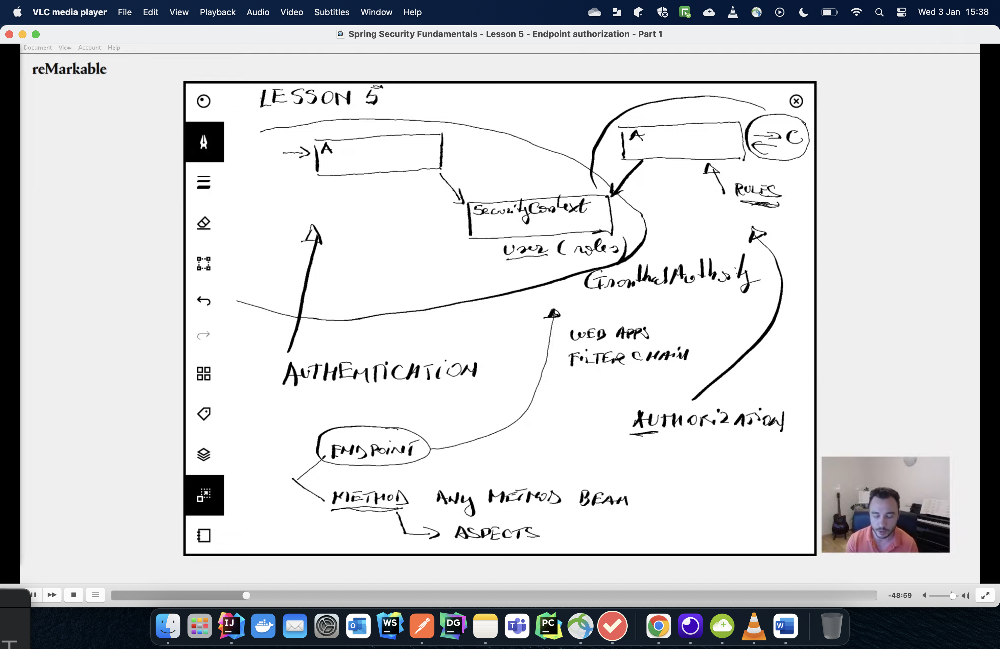
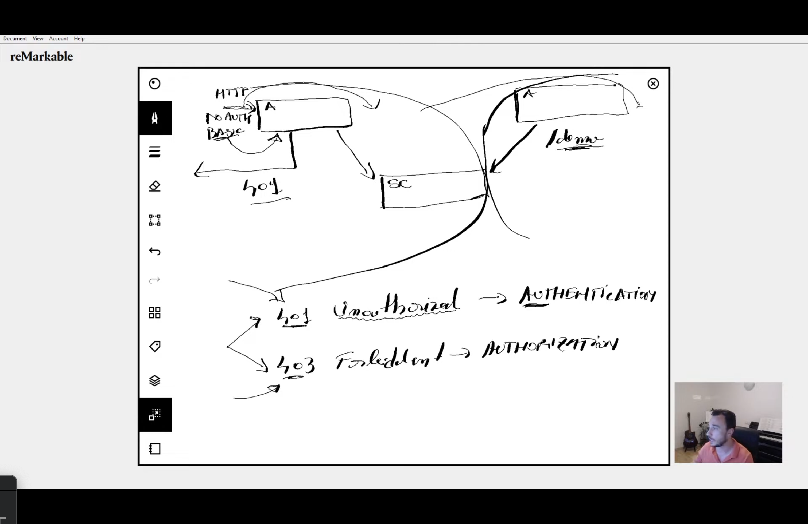

**Authorization**

````agsl
Happens after authentication.

The security context that is set after authentication has information about 
roles and authorities.

We therefore can introduce an authorization fitler, after authenitcation
where granted authorities are checked before exposing the resources

Authorization rules will be applied by an authorization filter before the controller.


Authenitication filter--->Authorization Filter---->Controller

There are two types of authorization:

(a)Enpoint Level-->Web applications.It is done through the filter chain
(b)Method Level-->Non Web Applications.It is done through aspects


````

**Authorization Flow diagram**



**Authentication To Authorization Filter**



**Common authorization rules**

```agsl

(a) .anyRequest().authenticated() //all requests must be authenticated
      
(b).anyRequest().permitAll()  

When i provide wrong http basic credentials with permitAll().the authentication filter will not pass the request to the authorization filter 
This is because you requested an authenitication that did not work.

```

**Status codes**

```agsl
Autheniticaton Failure - 401 unauthorized
Authorization Failure - 403 Fordbidden

```


**Roles and Authorities**

```agsl
Both Roles and Authority use the same badge or contract called
has granted authority.

Roles are badges saying who you are
Authorities are actions
```

**Big secret for endPoint Level Authorization**

```agsl
I only need to know:
 
 1.the request matcher patters,
 
   //1.which matcher methods should i use and why (anyRequest(),mvcMatchers(),antMatchers(),regex
  //2.How to apply different authorization rules
        
```

**Notes By MbuguaCaleb**
